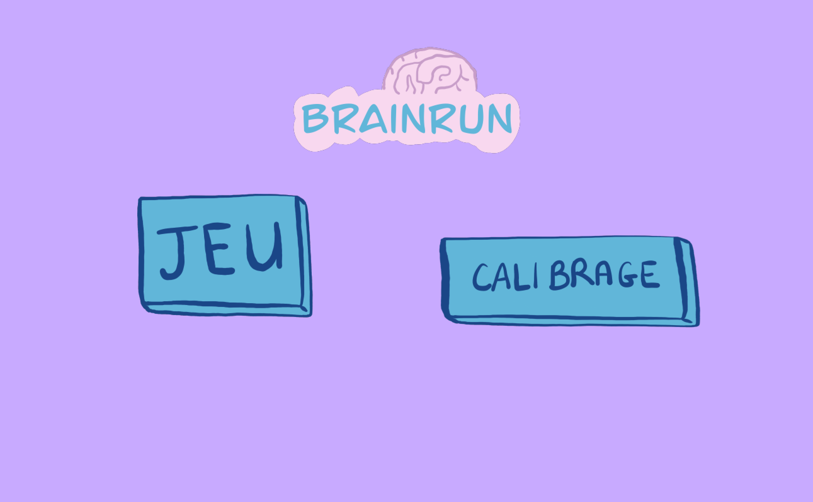

# HactionComplet Online BCI Control

This project now has a clear online control pipeline:

1. Read EEG from LSL
2. Build sliding/overlapping windows
3. Run model prediction
4. Send UDP commands to the game

The main script for this is [`online_windowing.py`](online_windowing.py).

## Project Layout

- `online_windowing.py`: online LSL windowing + model inference + optional UDP send
- `lsl_connect.py`: full-featured EEG bridge with recording, diagnostics, and game control
- `model_Data28_BIS.pkl`: CSP+LDA model used for prediction
- `test_lda.py`: smoke test for model loading/prediction
- `fake_lsl_eeg.py`: fake EEG LSL stream generator for testing
- `Hacktion_game-main/`: game with BCI integration (UDP receiver on `127.0.0.1:5005`)
- `RECORDING_FIX.md`: troubleshooting guide for EDF recording issues

## Install

```bash
pip install -r requirements.txt
```

## Game Demo: Mind-Control in Action

This prototype turns **brain activity into real-time movement**:

- `left_hand` prediction -> move the player **left**
- `right_hand` prediction -> move the player **right**
- real-time command stream -> **dodge obstacles** and survive longer

### Live Game Screen

<p align="center">
  
</p>

The in-game HUD displays BCI health (`WAITING / LIVE / STALE`), packet/command counters, and the latest decoded command.

### Gameplay Video

<p align="center">
  <video src="Video_game.mp4" controls preload="metadata" width="900">
    Your viewer does not support embedded video. Open
    <a href="Video_game.mp4">Video_game.mp4</a>.
  </video>
</p>

If embedded playback is not available on your platform, use this direct link: [Video_game.mp4](Video_game.mp4).

## Quick End-to-End Run (Real Game Control)

Terminal 1 (start game):

```bash
python Hacktion_game-main/Main.py
```

Optional model selection:

```bash
python Hacktion_game-main/Main.py --select-model
```

Or force one model:

```bash
python Hacktion_game-main/Main.py --model-path Hacktion_game-main/Model_simple/model_0010.pkl
```

Terminal 2 (start online BCI bridge):

```bash
python online_windowing.py \
  --stream-type EEG \
  --window-seconds 1.0 \
  --overlap-seconds 0.8 \
  --fixed-fs-hz 256 \
  --model-path model_Data28_BIS.pkl \
  --udp-host 127.0.0.1 \
  --udp-port 5005
```

## No EEG Hardware? Use Fake LSL Stream

Terminal A:

```bash
python fake_lsl_eeg.py --stream-name FakeEEG --stream-type EEG --sample-rate 250 --channels 8
```

Terminal B:

```bash
python online_windowing.py \
  --stream-name FakeEEG \
  --window-seconds 1.0 \
  --overlap-seconds 0.8 \
  --fixed-fs-hz 256 \
  --car \
  --bandpass-low-hz 1 \
  --bandpass-high-hz 40 \
  --model-path model_Data28_BIS.pkl \
  --udp-host 127.0.0.1 \
  --udp-port 5005
```

## Command Mapping to Game

Default label-to-UDP payload map is:

- `left_hand -> "-1"`
- `right_hand -> "1"`
- `idle -> "0"`

You can override with:

```bash
--udp-label-map '{"left_hand":"-1","right_hand":"1","idle":"0"}'
```

or pass a JSON file path.

## Useful Flags

- `--window-seconds`: window duration
- `--overlap-seconds` or `--stride-seconds`: sliding control
- `--fixed-fs-hz`: force model input sample rate (useful if model expects fixed rate)
- `--car`: apply common average reference
- `--bandpass-low-hz`, `--bandpass-high-hz`: optional FFT bandpass
- `--min-confidence`: minimum confidence required before UDP send
- `--health-interval-seconds`: periodic LSL health logs (`samples/sec`, `windows/sec`, stale/live)
- `--no-samples-warn-seconds`: warning threshold if stream goes silent

## Live Validation In Game

When you run `python Hacktion_game-main/Main.py`, the game now displays:

- `BCI UDP: WAITING/LIVE/STALE`
- total UDP packets and valid commands received
- last decoded BCI command with age
- keyboard fallback state

Press `K` in game to toggle keyboard fallback ON/OFF.  
Set it to `OFF` to verify headset-only control.

## Calibration -> EDF -> New Weights

From the game menu, run calibration. The calibration flow now:

1. Records EEG from LSL and saves `calibrage_recording_YYYYMMDD_HHMMSS.edf` at project root.
2. Tries to train a new CSP+LDA model from this EDF.
3. Saves model weights under `Hacktion_game-main/Model_simple/model_<edf_name>.pkl`.
4. Automatically sets this new model as active for the next game run in the same session.

Useful env options:

- `BCI_CALIBRATION_TRAIN=0` to skip auto-training after calibration
- `BCI_STREAM_NAME=...` / `BCI_SOURCE_ID=...` to target a specific EEG stream during calibration and game

## Validation Commands

Model smoke test:

```bash
python test_lda.py --model-path model_Data28_BIS.pkl --channels 8 --samples 256 --batch 3
```

List available LSL streams:

```bash
python online_windowing.py --list-streams
```
